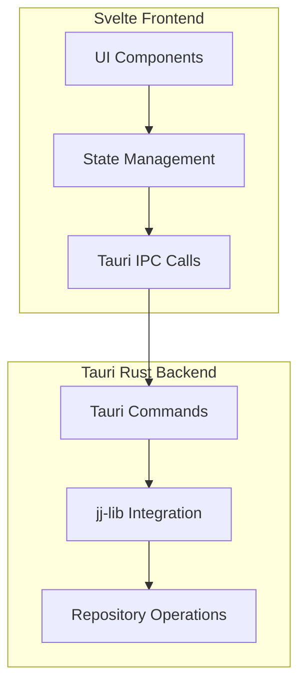
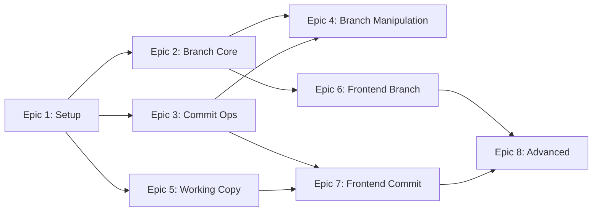

# JujuWe - Jujutsu GUI Implementation Plan

## Project Overview
Build a Tauri + Svelte GUI for jujutsu (jj) version control system with full virtual branch support using jj-lib directly.

## Architecture Overview



## Epic Structure

### Epic 1: Project Setup & jj-lib Integration
**Goal**: Set up the Rust backend with jj-lib and create Tauri command infrastructure

#### Tasks:
- [ ] 1.1 Configure jj-lib in Cargo.toml with correct features
- [ ] 1.2 Create jj_ops.rs module for jj-lib workspace bindings
- [ ] 1.3 Implement repository loader (open jj repo from path)
- [ ] 1.4 Create Tauri commands for basic jj operations
- [ ] 1.5 Add error handling for jj operations

**Tests**: Unit tests for jj_ops.rs mocking jj-lib calls

---

### Epic 2: Branch Management Core
**Goal**: Implement virtual branch listing, creation, deletion, and active branch selection

#### Tasks:
- [ ] 2.1 List all virtual branches from jj view
- [ ] 2.2 Create new virtual branch via jj-lib
- [ ] 2.3 Delete virtual branch
- [ ] 2.4 Set active/primary branch (where new commits go)
- [ ] 2.5 Persist active branch per repository

**Tests**: Integration tests for branch CRUD operations

---

### Epic 3: Commit Operations
**Goal**: Enable creating commits, viewing history, and amending

#### Tasks:
- [ ] 3.1 Create new commit on active branch
- [ ] 3.2 View commit history with pagination
- [ ] 3.3 Amend commit message
- [ ] 3.4 Uncommit (move changes back to working copy)
- [ ] 3.5 Show diff for changes

**Tests**: Test commit creation, history retrieval, amend operations

---

### Epic 4: Branch Manipulation (Move/Rebase)
**Goal**: Allow moving commits between branches and reordering

#### Tasks:
- [ ] 4.1 Move commits between branches (rebase)
- [ ] 4.2 Reorder commits within a branch
- [ ] 4.3 Merge branches virtually (jj merge)
- [ ] 4.4 Split commits

**Tests**: Test rebase operations, branch merge scenarios

---

### Epic 5: Working Copy Operations
**Goal**: Handle file changes, staging, and diff viewing

#### Tasks:
- [ ] 5.1 Detect and list changed files
- [ ] 5.2 Stage/unstage files for commit
- [ ] 5.3 Discard changes
- [ ] 5.4 Show file diffs
- [ ] 5.5 Watch for file system changes

**Tests**: Test file staging, diff generation

---

### Epic 6: Frontend - Branch UI
**Goal**: Build the Svelte UI components for branch visualization

#### Tasks:
- [ ] 6.1 Create Svelte stores for repository state
- [ ] 6.2 Build Tauri invoke wrappers in TypeScript
- [ ] 6.3 Create virtual branch list component
- [ ] 6.4 Implement active branch selector dropdown
- [ ] 6.5 Create branch tree visualization

**Tests**: Component tests for branch list, selector tests

---

### Epic 7: Frontend - Commit UI
**Goal**: Build the commit creation and history UI

#### Tasks:
- [ ] 7.1 Build commit creation form
- [ ] 7.2 Implement commit history list view
- [ ] 7.3 Create diff viewer component
- [ ] 7.4 Add file staging interface

**Tests**: Component tests for commit form, diff viewer tests

---

### Epic 8: Advanced Features
**Goal**: Add polish features for power users

#### Tasks:
- [ ] 8.1 Drag-and-drop branch reordering
- [ ] 8.2 Multi-branch merge preview
- [ ] 8.3 Keyboard shortcuts
- [ ] 8.4 Loading states and error handling

**Tests**: E2E tests for drag-drop, keyboard shortcut tests

---

## Epic Dependencies



## Key Feature: Active Branch Selector

The user's requirement: "Suppose I 'merge' virtually 3 different branches, I want the commits that are on top of it to go to a specific branch"

This maps to jj's concept of the "primary" or "active" virtual branch. When you have multiple virtual branches stacked, you designate one as the receiver for new commits.

## File Structure

```
src-tauri/
├── src/
│   ├── lib.rs              # Tauri command definitions
│   ├── jj_ops.rs           # jj-lib operations
│   ├── branch.rs           # Branch management
│   ├── commit.rs           # Commit operations
│   ├── repo.rs             # Repository operations
│   └── working_copy.rs     # Working copy operations

src/
├── lib/
│   ├── stores/              # Svelte stores
│   ├── components/          # UI components
│   │   ├── BranchList.svelte
│   │   ├── BranchSelector.svelte
│   │   ├── BranchTree.svelte
│   │   ├── CommitForm.svelte
│   │   ├── CommitHistory.svelte
│   │   ├── DiffViewer.svelte
│   │   └── FileStaging.svelte
│   └── types.ts            # TypeScript types
└── routes/
    └── +page.svelte       # Main UI
```

## Testing Strategy

Each epic has associated tests:
- **Epic 1**: Unit tests for jj_ops.rs
- **Epic 2**: Integration tests for branch CRUD
- **Epic 3**: Integration tests for commit operations
- **Epic 4**: Integration tests for rebase/merge
- **Epic 5**: Unit tests for file operations
- **Epic 6**: Component tests (Vitest + Testing Library)
- **Epic 7**: Component tests for commit UI
- **Epic 8**: E2E tests (Playwright)
